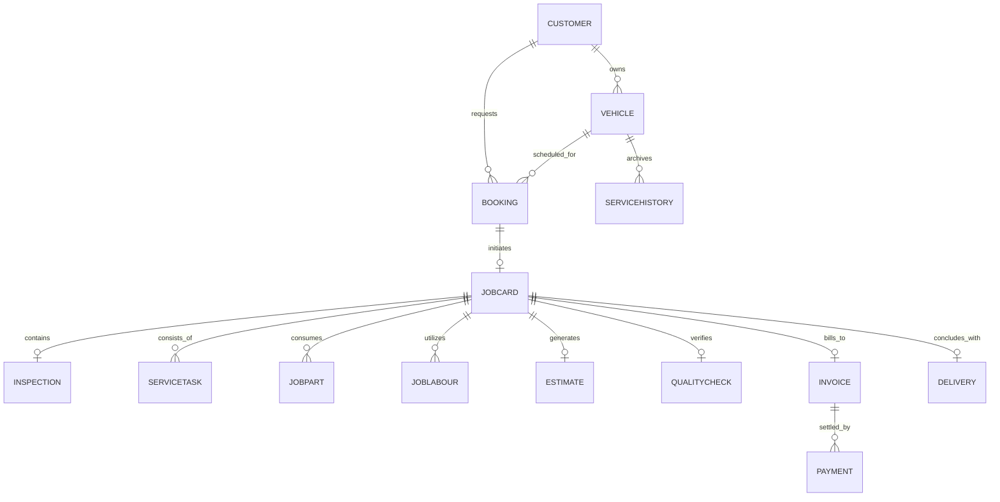

# AUTOCARE 360 — Business Process & Engineering Analysis

**Platform**: AUTOCARE 360  
**Tagline**: Complete Vehicle Service Management System  
**Framework Methodology**: Understand → Analyse → Design → Build → Explain  

---

## 1. UNDERSTAND

### 1.1 The Business Domain
Modern automotive service centers operate in a high-velocity, high-liability environment. A typical service center handles dozens of vehicles daily across multiple service bays, service advisors, diagnostic technicians, inventory managers, quality inspectors, and cashiers.

In conventional, fragmented setups, service centers suffer from:
1. **Disconnected Silos**: Bookings exist in diary logs, parts in legacy ERPs, customer approvals on phone calls or WhatsApp, and invoices in accounting software.
2. **Revenue Leakage**: Parts allocated by technicians without stock reservation or tax calculation leading to inventory discrepancies and unbilled labour hours.
3. **Customer Friction & Mistrust**: Lack of transparent estimates, unapproved charges, or unexpected billing leads to customer disputes and negative reviews.
4. **Safety & Quality Liabilities**: Vehicles handed over without systematic road testing, torque verification, or clearing diagnostic trouble codes (DTCs).

### 1.2 The Core Connected Business Process
AUTOCARE 360 unites the automobile workshop lifecycle into **one continuous, connected pipeline**:
```
Customer Registration ➔ Vehicle Registration ➔ Service Booking ➔ Vehicle Check-In ➔
Digital Inspection ➔ Service Tasks ➔ Parts Allocation ➔ Labour Estimation ➔
Service Estimate ➔ Customer Approval ➔ Service Execution ➔ Quality Check ➔
Tax Invoice ➔ Payment Settlement ➔ Vehicle Delivery Handover ➔ Service History
```

---

## 2. ANALYSE

### 2.1 Persona Roles and Responsibilities
To mirror real-world automobile service centers, AUTOCARE 360 implements 6 discrete personas:

| Role | Responsibilities | Core Workflows |
|---|---|---|
| **Admin** | Full system governance, inventory catalogues, staff roles, reporting | Configuration, restock authorization, audit trail |
| **Service Advisor** | Customer engagement, vehicle check-in, initial complaints, customer approval gateway | Check-in desk, estimate presentation, delivery handover |
| **Service Manager** | Workshop floor supervision, technician task delegation, quality check certification | QA checklists, task allocation, turnaround time |
| **Technician** | Physical vehicle inspection, execution of service tasks, parts consumption | 20-point digital inspection, task progress updates |
| **Billing Staff** | Commercial invoice generation, GST tax verification, multi-method payment receipt | Invoice tracking, payment recording (UPI/Card/Cash) |
| **Customer** | Transparency portal: tracking service progress, approving/rejecting estimates | Customer Portal, 1-click approvals, digital invoice copy |

### 2.2 Critical Business Rules Enforced
1. **Vehicle-to-Customer Foreign Key**: A vehicle cannot exist in isolation; it must be registered under a valid customer with a unique registration plate and VIN.
2. **Conflict Prevention**: Duplicate bookings for the same vehicle at overlapping appointment slots are strictly prevented.
3. **Inspection Before Estimate**: Systematic 20-point digital checklist (Exterior, Interior, Engine, Safety) must record item conditions (GOOD, ATTENTION, CRITICAL).
4. **Approval Gate for Execution**: Technicians are restricted from beginning repair tasks until the customer formally APPROVES the digital estimate.
5. **Inventory Non-Negativity & Auto-Deduction**: Allocating a part automatically reserves inventory and deducts stockQuantity. If stock falls below reorder thresholds, low-stock notifications are dispatched. Allocation requests exceeding stock are rejected.
6. **Statutory Tax & Calculation Precision**: Subtotal = Parts + Labour + Consumables - Discounts + GST (18%).
7. **Quality Check Certification**: Vehicles cannot be delivered without a certified 6-point Quality Inspection PASSED by the Service Manager.
8. **Financial Clearance Gate**: Delivery handover is blocked unless invoice balance is ₹0 (payment settled in full).
9. **Permanent Service Archival**: On delivery, an immutable snapshot of all services, replaced parts, odometer, and staff is written to the vehicle's permanent `ServiceHistory`.

---

## 3. DESIGN

### 3.1 Entity-Relationship Model



### 3.2 Job Card State Machine Transition Model
The `JobCard` entity transitions through a deterministic state machine:
- `DRAFT`: Initial vehicle intake.
- `INSPECTION`: Vehicle physically in bay; technician completing digital checklist.
- `ESTIMATE_CREATED`: Checklist complete; parts and labour compiled into initial quote.
- `WAITING_FOR_APPROVAL`: Estimate published to customer portal.
- `APPROVED`: Customer accepted estimate (unlocks task execution).
- `IN_PROGRESS`: Technicians actively executing tasks; overall % calculating.
- `QUALITY_CHECK`: 100% tasks completed; manager conducts road test & QA checklist.
- `READY_FOR_DELIVERY`: QA passed and tax invoice generated.
- `DELIVERED`: Full payment cleared; final odometer captured; archived to service history.
- `CANCELLED`: Aborted or customer declined with vehicle returned.

---

## 4. BUILD

### 4.1 Technology Architecture
- **Framework**: Next.js 14 App Router (`app/` directory) with React 18 and TypeScript.
- **Styling**: Tailwind CSS with an automotive corporate theme (Deep Blue `#1e40af`, Slate `#0f172a`, Emerald `#059669`).
- **Icons & Visuals**: Lucide React iconography and Recharts analytics.
- **Data Persistence**: Production relational database engine with JSON disk persistence (`data/autocare360.db.json`) and atomic write locking.
- **Document Generation**: jsPDF with jsPDF-AutoTable for client-side and server-side PDF GST Tax Invoice exports.

### 4.2 Code Structure
```
├── app/
│   ├── api/             # 18 RESTful API routes enforcing business logic & validation
│   ├── bookings/        # Appointment scheduling & conflict prevention
│   ├── check-in/        # Vehicle physical intake desk
│   ├── jobs/            # Workshop job cards & master workspace (/jobs/[id])
│   ├── customer-portal/ # Dedicated customer experience with 1-click approvals
│   ├── inventory/       # Parts catalogue, real-time stock deduction, restock
│   ├── billing/         # Tax invoices, multi-method payment receipt, PDF export
│   ├── delivery/        # Delivery clearance gates & vehicle handover
│   ├── history/         # Vehicle lifetime service history audit
│   ├── customers/       # Customer CRM & fleet registration
│   ├── reports/         # Executive analytics & CSV export
│   ├── audit/           # Immutable event security trail
│   ├── globals.css      # Automotive styling & custom scrollbars
│   └── layout.tsx       # Root shell with AuthProvider & Sidebar
├── components/          # Reusable UI components (Header, Sidebar, Badges, Walkthrough)
├── lib/
│   ├── authContext.tsx  # Role-based context & quick persona switching
│   └── db/              # Relational database service & Indian automotive seed dataset
├── types/               # Strict TypeScript domain interfaces
├── scripts/             # Automated test suite runner (scripts/test-runner.js)
└── docs/                # Comprehensive architectural documentation
```

---

## 5. EXPLAIN

### 5.1 Business Value Realized
1. **Zero Unapproved Work**: Customer approval gateway ensures 100% authorization before wrench touches bolt.
2. **Zero Inventory Leakage**: Parts cannot be installed without deducting stock; negative stock is physically barred in backend logic.
3. **Turnaround Acceleration**: Digital inspection checklists instantly populate parts and labour items into the estimate.
4. **Enhanced Customer Trust**: Customers can log into their private portal from any smartphone, view task progress in real time, and review itemized costs down to the rupee.
5. **Regulatory Compliance**: GST-compliant invoices with HSN/SAC categorizations, 18% tax calculation, and timestamped audit logs.
